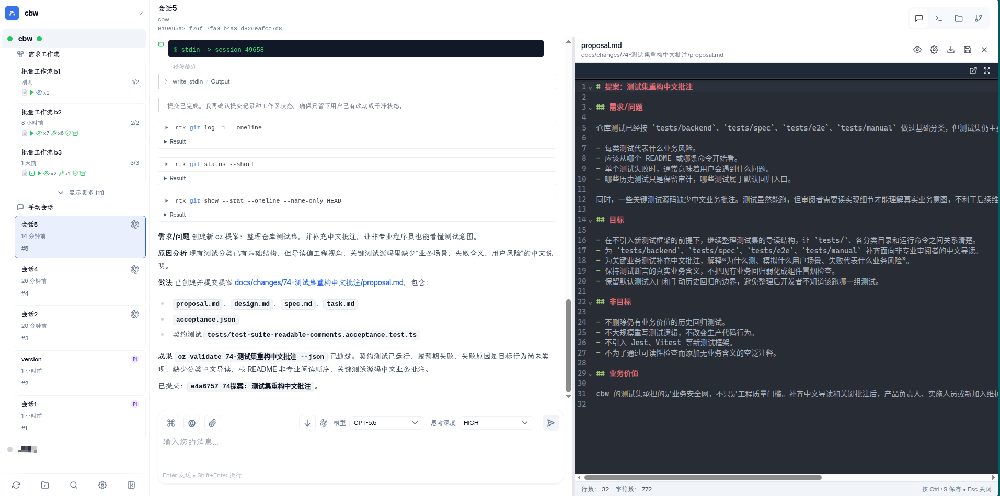
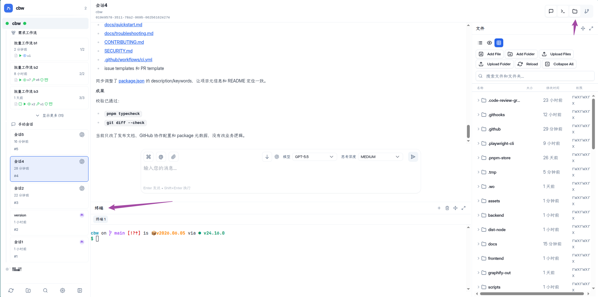

# ozw - 本地 AI 编程接力站

[English](./README_en.md) | 中文

---

**ozw** 是面向 Codex、Pi 和 [oz](https://github.com/xbugs221/oz) 工作流的本地 Web 工作台。项目从 [claudecodeui](https://github.com/siteboon/claudecodeui) 演进而来，当前重点是把智能体编程会话、`oz flow` 工作流、项目文件、终端和跨设备访问放到同一个浏览器界面里。

### 为什么要做这个？（核心痛点）

以往的智能体编程（Agentic Coding）往往被锁死在某一台机器的终端或者某个特定的 IDE 插件里。如果你下班了、换电脑了，或者想在手机上临时盯一下进度，通常很难做到。当然，你可以用 tailnet 之类的东西组网然后 ssh + tmux 来实现，但依旧困在终端界面。跨设备接力的最直观方案，还是通过浏览器。

**ozw 最大的收益在于：让 Agentic Coding 彻底脱离单机限制。**

通过 ozw，你的编程任务不再是本地的一个进程，而是一个可以“接力”的 Web 运行记录。只要你配合 `frp`、`nps`、Cloudflare Tunnel 等工具将端口暴露到公网，你就可以：

1. **在主力开发机** 启动一个耗时较长的 `oz` 任务。
2. **在通勤路上** 通过手机浏览器查看智能体当前的执行步骤。
3. **回到家里** 换上私人电脑，直接在网页上接手任务，继续 Review 代码或点击执行。





### 当前能力

| 模块 | 作用 |
|---|---|
| 手动会话 | 在浏览器里创建、继续和查看 Codex/Pi 会话 |
| 工作流 | 读取、启动、恢复和终止 `oz flow` 运行记录 |
| 项目工作台 | 文件树、代码编辑器、终端和项目总览 |
| 实时同步 | 通过 WebSocket 展示会话输出、工具调用和工作流状态 |
| 自托管访问 | 支持本地、服务器、反向代理和 PWA 桌面入口 |

### 快速开始

> **发布状态：** `ozw` 是当前候选包名，公共 NPM 包尚未发布，包名所有权和发行验收仍待完成。下面的注册表命令是**发布后的正式入口**，现在请勿从公共注册表安装同名包。

发布后，首选全局安装：

```sh
npm install -g ozw
ozw
```

公开发布前，只使用维护者提供的候选包：

```sh
npm install -g ./ozw-VERSION.tgz
ozw
```

首次运行会创建 `~/.ozw`、生成 32 字符的 `OZW_ACCESS_TOKEN`，并输出登录地址。交互式终端仅在新生成时显示令牌；systemd、重定向等非交互运行不会把令牌写入日志，请从 `~/.ozw/.env` 查看。默认地址为 `http://127.0.0.1:3001`，只允许本机访问。

`oz`、Codex 和 Pi 都是按功能启用的可选依赖：缺少它们不会阻止工作台启动，只会禁用对应的工作流或会话能力。启动后可在设置页的运行时诊断中查看缺失项。

`node-pty` 是 Web 终端的可选依赖；缺失时基础 HTTP/WebUI 仍可启动，但终端不可用，重装 optional 依赖即可恢复。

跨设备访问必须显式修改监听地址，并放在可信的 HTTPS 反向代理或隧道之后；不要把带有仓库、终端和 provider 凭据访问能力的 ozw 直接暴露到公网。

升级与卸载：

```sh
npm update -g ozw
npm uninstall -g ozw
```

升级和卸载都保留 `~/.ozw` 中的配置与数据库。源码开发、候选包验收、远程访问和数据清理说明见 [快速开始](docs/quickstart.md)，故障排除见 [docs/troubleshooting.md](docs/troubleshooting.md)，版本变更见 [CHANGELOG.md](CHANGELOG.md)。

通过 HTTPS 访问时，可将 PWA 添加到手机主屏幕。

---

## ⚖️ 许可证

ozw 采用 **GPL-3.0** 许可证开源。详见 [LICENSE](LICENSE)。
