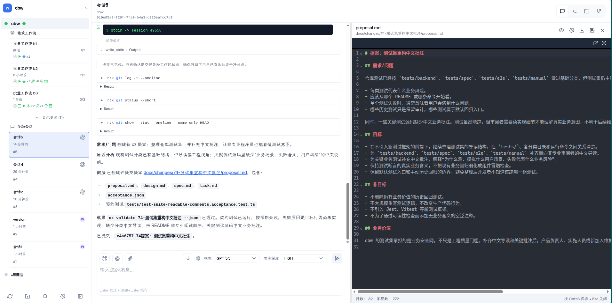
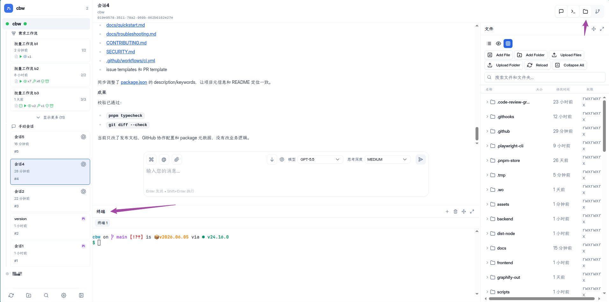

# ozw - 基于 ccui 的 AI 编程接力站

[English](./README.md) | 中文

---

**ozw** 基于 [claudecodeui](https://github.com/siteboon/claudecodeui) 改造而来。吸收融合了 `openspec` 的SDD概念，并引入了 [oz](https://github.com/xbugs221/oz)

### 为什么要做这个？（核心痛点）

以往的智能体编程（Agentic Coding）往往被锁死在某一台机器的终端或者某个特定的 IDE 插件里。如果你下班了、换电脑了，或者想在手机上临时盯一下进度，通常很难做到。当然，你可以用 tailnet 之类的东西组网然后ssh+tmux来实现，但依旧困在终端界面。跨设备接力的最直观方案，还是通过浏览器。

**ozw 最大的收益在于：让 Agentic Coding 彻底脱离单机限制。**

通过 ozw，你的编程任务不再是本地的一个进程，而是一个可以“接力”的 Web 运行记录。只要你配合 `frp`、`cloudflare tunnel` 等工具将端口暴露到公网，你就可以：

1. **在主力开发机** 启动一个耗时较长的 `oz` 任务。
2. **在通勤路上** 通过手机浏览器查看智能体当前的执行步骤。
3. **回到家里** 换上私人电脑，直接在网页上接手任务，继续 Review 代码或点击执行。





### 快速开始

1. **环境：** 需要 Node.js 22+, pnpm 10.33+, 以及已安装在 PATH 中的 `oz`。
2. **启动：**

   ```sh
   pnpm install
   pnpm start
   ```

3. **公网访问（推荐）：** 使用 `frp` 或 `nps` 将本地端口（默认 5173/3001）映射出去，开启你的跨设备编程之旅。

更多技术细节请参考 [docs/quickstart_zh.md](docs/quickstart_zh.md)。

---

## ⚖️ 许可证

ozw 采用 **GPL-3.0** 许可证开源。详见 [LICENSE](LICENSE)。
