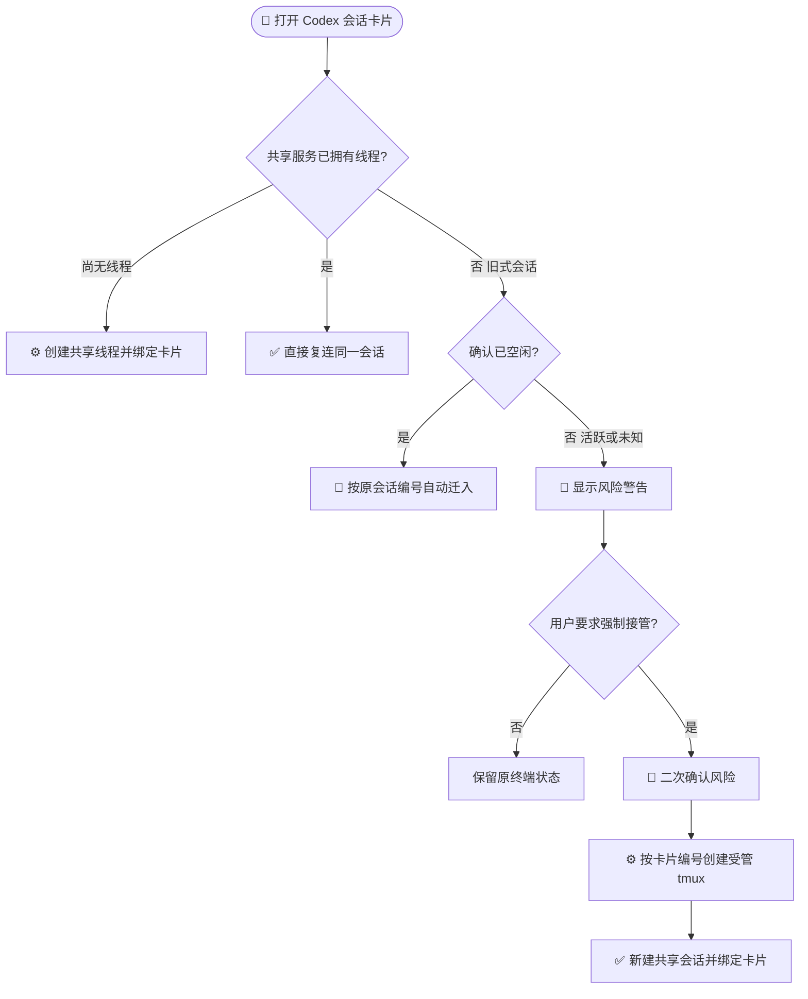

# 快速开始

[English](./quickstart_en.md) | 中文

---

本指南将帮助你在本地或服务器上启动并运行 **ozw**。

### 1. 检查基础环境

- **Node.js 24.17.0**：以 `.nvmrc` 为准。
- **pnpm 11.10.0**：以 `package.json` 的 `packageManager` 字段为准，建议使用 Corepack 固定版本。
- **oz**：必须安装在服务进程 `PATH` 中。ozw 启动时会检查 `oz flow contract --json`，并通过 `oz list` 发现活跃变更、通过 `oz flow` 执行工作流。
- **Codex/Pi**：不是服务启动硬依赖；只有使用对应聊天 provider 时，才需要在同一台机器上完成官方安装和登录。

```sh
corepack enable
corepack prepare pnpm@11.10.0 --activate
node --version
pnpm --version
oz --version
oz flow contract --json
```

### 2. 获取代码并配置

```sh
git clone https://github.com/xbugs221/ozw.git
cd ozw
pnpm install
pnpm run hooks:install
cp .env.example .env
```

至少修改 `.env` 中的 `JWT_SECRET`。公网部署还建议设置 `CREDENTIAL_ENCRYPTION_KEY`，并确认 `HOST`、`PORT` 与反向代理配置一致。

| 配置项 | 默认值 | 用途 |
|---|---:|---|
| `PORT` | `3001` | 生产 Web 页面、API 和 WebSocket 端口 |
| `VITE_PORT` | `5173` | 开发模式前端端口 |
| `HOST` | `0.0.0.0` | 服务监听地址 |
| `JWT_EXPIRES_IN` | `24h` | 登录令牌有效期 |
| `OZW_TRUST_LOCALHOST_AUTH` | `true` | 本机访问是否信任首个本地账号 |
| `CODEX_SANDBOX_MODE` | `danger-full-access` | Codex 默认沙箱策略 |
| `CODEX_APPROVAL_POLICY` | `never` | Codex 默认审批策略 |

### 3. 启动方式

生产或服务器运行：

```sh
pnpm start
```

`pnpm start` 会先执行构建，再由后端在 `PORT` 上提供静态页面、API 和 WebSocket。默认访问地址是：

```text
http://localhost:3001
```

本地开发运行：

```sh
pnpm dev
```

开发模式默认访问地址是：

```text
http://localhost:5173
```

首次访问时创建单用户账号。若已经有账号，本机 `localhost` 访问默认可直接复用首个账号；需要强制登录时设置 `OZW_TRUST_LOCALHOST_AUTH=false`。

### 4. 实现“编程接力”（推荐配置）

为了发挥 ozw 跨设备接力的最大优势，建议将其部署在公网可达的环境中：

- **公网服务器：** 直接在服务器启动。
- **本地开发机：** 使用 `frp`、`nps` 或 Cloudflare Tunnel。

生产模式通常只需要映射 `PORT=3001`。开发模式才需要同时关注 `5173` 前端端口和 `3001` 后端端口。

公网部署建议：

| 项目 | 建议 |
|---|---|
| 协议 | 使用 HTTPS，方便 PWA 和移动端访问 |
| 认证 | 设置强 `JWT_SECRET`，关闭不需要的本机信任 |
| Provider | 确认服务进程能访问 `oz`、`codex` 等命令和对应账号文件 |
| 数据 | 默认数据库在 `~/.ozw/ozw.db`，可用 `DATABASE_PATH` 调整 |

### 5. 验证

打开浏览器访问你的 ozw 地址。

1. 确认文件树能正常加载你的项目。
2. 在 Workflows 视图中确认能看到 `oz list --json` 读取到的活跃变更。
3. 尝试启动一个 `oz` 运行记录，并观察它是否在多台设备间同步状态。
4. 如果使用 Codex/Pi 聊天，分别新建一次手动会话，确认 provider 认证和模型列表可用。

### 6. Codex 会话卡片如何接管

| 类型 | 普通用户判断方式 |
|---|---|
| 新式会话 | 已由共享 Codex 服务管理，可从网页或终端继续同一会话 |
| 旧式会话 | 来自旧版或独立 Codex 进程，共享服务尚未拥有它 |

| 卡片状态 | 打开后的处理 |
|---|---|
| 新建卡片，尚无线程 | 创建共享线程并自动绑定卡片 |
| 新式会话，活跃或空闲 | 直接复连；活动任务保持连续 |
| 旧式会话，明确空闲 | 自动使用原会话编号迁入共享服务 |
| 旧式会话，活跃或未知 | 先显示警告；确认后保留卡片编号，创建受管 tmux 和新式共享会话 |



> 强制接管保留卡片编号，但会换成新的共享 Codex 会话；原终端不会被停止。

---

## 常用命令

```sh
pnpm run typecheck          # 检查前端、后端和测试类型
pnpm run test:fast          # 快速门禁：类型、单元和后端冒烟
pnpm run test:server        # 后端测试
pnpm run test:e2e:smoke     # 浏览器冒烟测试
pnpm run build              # 构建生产前后端
```
