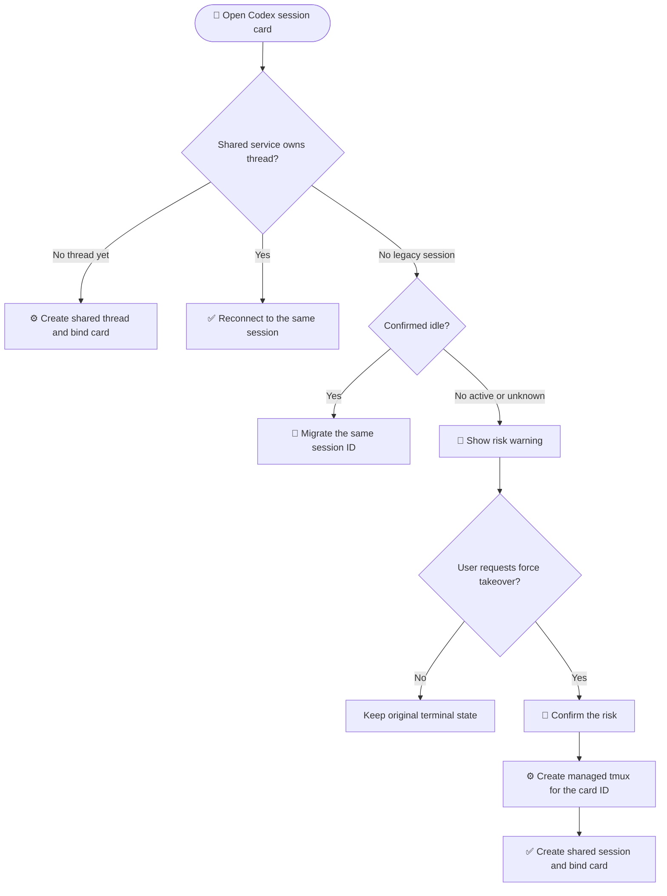

# Quick Start

English | [中文](./quickstart.md)

---

This guide will get **ozw** up and running on your local machine or server.

### 1. Prerequisites

- **Node.js 26.4.0**: recommended; minimum 24.17.0, matching `.nvmrc` and `package.json`.
- **pnpm 11.10.0**: match the `packageManager` field in `package.json`; Corepack is recommended.
- **oz**: must be available on the service process `PATH`. ozw checks `oz flow contract --json` during startup, uses `oz list` to discover active changes, and uses `oz flow` to run workflows.
- **Codex/Pi**: not required for ozw to start. For Codex, an authenticated app-server daemon must run independently under the system service manager; ozw only connects to its Unix socket. Install and authenticate Pi through its official flow.

```sh
corepack enable
corepack prepare pnpm@11.10.0 --activate
node --version
pnpm --version
oz --version
oz flow contract --json
```

### 2. Clone and Configure

```sh
git clone https://github.com/xbugs221/ozw.git
cd ozw
pnpm install
pnpm run hooks:install
cp .env.example .env
openssl rand -hex 16  # copy the output to OZW_ACCESS_TOKEN in .env
```

`OZW_ACCESS_TOKEN` is the only browser login credential and must contain exactly 32 characters. ozw generates and persists the JWT signing secret beside the database for internal sessions only. For deployment, also confirm `HOST`, `PORT`, and reverse proxy settings.

| Setting | Default | Purpose |
|---|---:|---|
| `PORT` | `3001` | Production Web UI, API, and WebSocket port |
| `VITE_PORT` | `5173` | Frontend dev-server port |
| `HOST` | `0.0.0.0` | Bind address |
| `OZW_ACCESS_TOKEN` | required | 32-character browser access token |
| `JWT_EXPIRES_IN` | `24h` | Login token lifetime |

### 3. Run

Production or server mode:

```sh
pnpm start
```

`pnpm start` builds the frontend and backend, then serves the static Web UI, API, and WebSocket from `PORT`. Default URL:

```text
http://localhost:3001
```

Development mode:

```sh
pnpm dev
```

Default development URL:

```text
http://localhost:5173
```

On first visit, enter `OZW_ACCESS_TOKEN`; there is no account creation or selection. Localhost and remote access use the same authentication flow.

### 4. Enable "Relay Coding" (Recommended)

To fully leverage the cross-device benefits, run ozw in a web-accessible environment:

- **Cloud Server:** Run it directly on your remote VPS.
- **Local Workstation:** Use a reverse proxy like `frp`, `nps`, or Cloudflare Tunnel.

Production mode usually only needs `PORT=3001` exposed. Development mode is the case where both frontend `5173` and backend `3001` matter.

Deployment checklist:

| Item | Recommendation |
|---|---|
| Protocol | Use HTTPS for PWA and mobile access |
| Auth | Protect `OZW_ACCESS_TOKEN`, the database, and the generated signing-secret file |
| Providers | Ensure ozw can access `oz`, `codex`, and provider auth files; run Codex app-server independently as a system daemon |
| Data | Keep the default SQLite database on local storage at `~/.ozw/ozw.db`; do not place it on an NFS/SMB share (remote project directories are fine) |

### 5. Verification

Open ozw in your browser.

1. Confirm the file tree loads your project correctly.
2. Go to the Workflows view and ensure you see active changes read from `oz list --json`.
3. Start an `oz` run and check if you can monitor its progress from another device.
4. If you use Codex/Pi chat, create one manual session for each provider and confirm auth and model discovery work.

### 6. How Codex session cards hand off

| Type | What it means to a user |
|---|---|
| Shared session | Already hosted by the independent Codex system service and safe to continue from web or terminal |
| Legacy session | Created by an older or private Codex process and not loaded by the system service yet |

| Card state | What happens when opened |
|---|---|
| New card without a thread | Creates a shared thread and binds the card |
| Shared session, active or idle | Reconnects directly; an active task stays continuous |
| Legacy session, confirmed idle | Migrates the same session ID into the shared service automatically |
| Legacy session, active or unknown | Shows a warning; confirmation keeps the card ID and creates a managed tmux plus a new shared session |



> Force takeover keeps the card ID but replaces its Codex thread with a new shared session. The original terminal is not stopped.

---

## Useful Commands

```sh
pnpm run typecheck          # Check frontend, backend, and test types
pnpm run test:fast          # Fast gate: types, unit tests, backend smoke tests
pnpm run test:server        # Backend tests
pnpm run test:e2e:smoke     # Browser smoke tests
pnpm run build              # Production frontend/backend build
```
